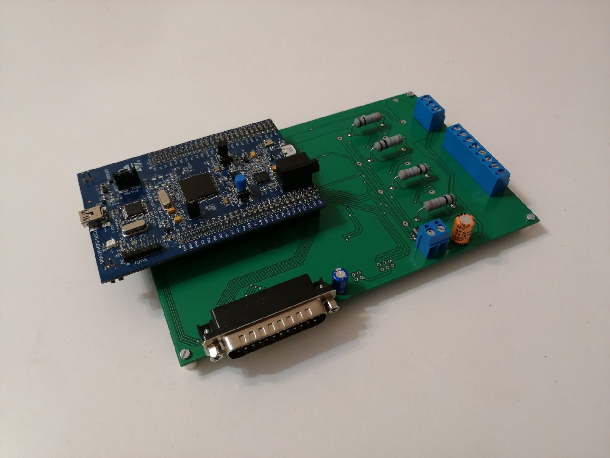

# My diploma

## Source code 

https://github.com/yungvldai/dbmc

## Demo 



## Installing

```bash
git clone https://github.com/yungvldai/diploma
cd diploma
npm install
```

java, xelatex and biber are also needed.

## Usage

 - `npm run build` builds production version of main document, including TOC, sources and references;
 - `npm run build-dev` builds development version of main document only;
 - `npm run watch` runs watcher, which observe changes in folders `src/` and `lib/`,
 it runs `fast-rebuild` document on change.
 - `npm run release` builds document, merges all of pdfs, creates release commit and tag, then pushes to remote.
 - `npm run clean` cleans `build/` and `document/`. Use in emergencies.
